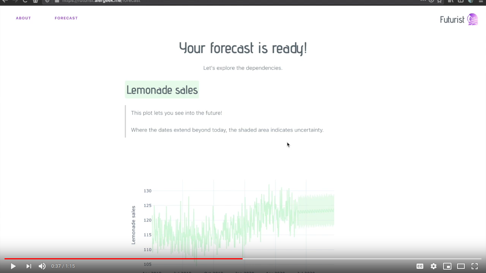
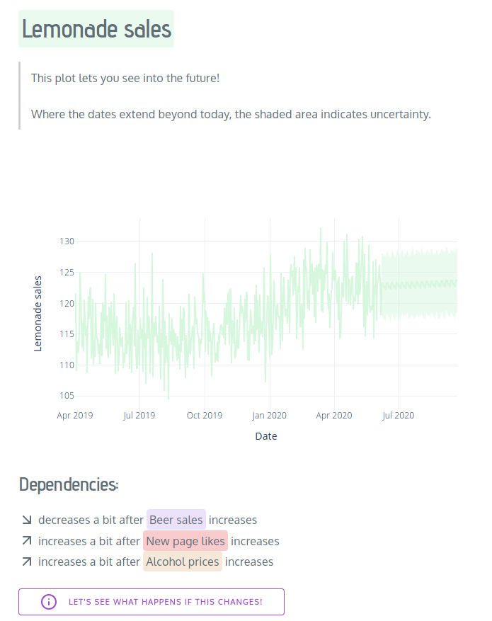

# Futurist
Big data for small businesses.

## What is this?
Futurist is a web application which brings statistics to small businesses. Upload the Excel file in which you've been writing down your lemonade sales, and Futurist will show you:
* How your sales are likely to change in the future
* How your sales depend on how many likes you're getting on Facebook
* What would happen if you got more likes

## What's the story?
Futurist was made in 40 hours for [HackYeah](https://hackyeah.pl/), Europe's biggest stationary hackathon, by [Nicholas Bochenski](https://github.com/malyvsen) and [Franciszek Madej](https://github.com/kosciak9). We placed third!

We wanted to help small businesses turn their data into valuable insights. Big companies do it all the time, but small ones don't have the knowledge and resources required. We believe it doesn't have to be so, and that's why we built Futurist.

## Check it out!
Futurist is live at [futurist.alergeek.me](https://futurist.alergeek.me/). It'll stay live until mid-July 2020.

## What's the future for Futurist?
It depends on BGK, the bank organizing the hackathon. Hopefully they'll let us develop it further!